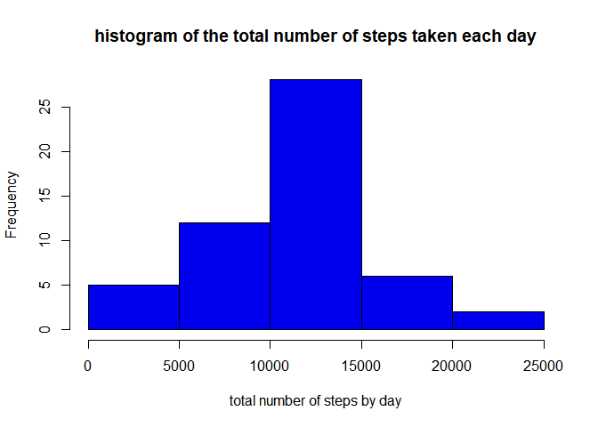
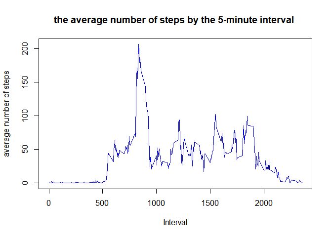
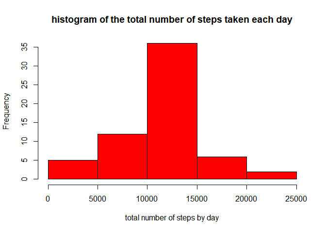
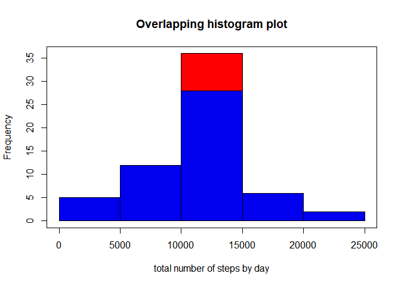
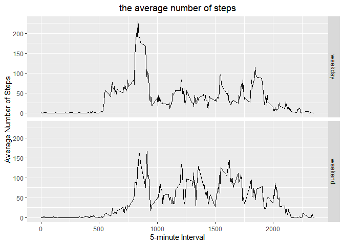

## Loading required Packages


```r
library(dplyr)
library(ggplot2)
```


## Loading and preprocessing the data


```r
filezip="AM_DATA.zip" #Name of zipfile in my working repository, AMD means Activity Monitoring

if (!file.exists(filezip)){
  link_Url_data <- "https://d396qusza40orc.cloudfront.net/repdata%2Fdata%2Factivity.zip"
  download.file(link_Url_data, filezip)
}


# Checking if folder exists and to unzip into under folder named AM_DATA
if (!file.exists("AM_DATA")) { 
  unzip(filezip) 
}

my_data_activity = read.csv("activity.csv", sep=",")

my_data_activity$date=as.Date(my_data_activity$date, "%Y-%m-%d" )

str(my_data_activity)
```

```
## 'data.frame':	17568 obs. of  3 variables:
##  $ steps   : int  NA NA NA NA NA NA NA NA NA NA ...
##  $ date    : Date, format: "2012-10-01" "2012-10-01" ...
##  $ interval: int  0 5 10 15 20 25 30 35 40 45 ...
```

```r
summary(my_data_activity)
```

```
##      steps             date               interval     
##  Min.   :  0.00   Min.   :2012-10-01   Min.   :   0.0  
##  1st Qu.:  0.00   1st Qu.:2012-10-16   1st Qu.: 588.8  
##  Median :  0.00   Median :2012-10-31   Median :1177.5  
##  Mean   : 37.38   Mean   :2012-10-31   Mean   :1177.5  
##  3rd Qu.: 12.00   3rd Qu.:2012-11-15   3rd Qu.:1766.2  
##  Max.   :806.00   Max.   :2012-11-30   Max.   :2355.0  
##  NA's   :2304
```


## What is mean total number of steps taken per day?


```r
#1. Make a histogram of the total number of steps taken each day

my_data_activity_1=my_data_activity%>%na.omit()%>%group_by(date)%>%summarise(steps=sum(steps))

hist(my_data_activity_1$steps, xlab ="total number of steps by day" , main="histogram of the total number of steps taken each day", col = "blue2" )
```



```r
#2.Calculate and report the **mean** and **median** total number of steps taken per day

summary(my_data_activity_1$steps)[c(3,4)]
```

```
##   Median     Mean 
## 10765.00 10766.19
```


## What is the average daily activity pattern?


```r
#1.  Make a time series plot (i.e. `type = "l"`) of the 5-minute interval (x-axis) and the average number of steps taken, averaged across all days (y-axis)

my_data_activity_2=my_data_activity%>%na.omit()%>%group_by(interval)%>%summarise(steps=mean(steps))

plot(my_data_activity_2$interval,my_data_activity_2$steps, xlab="Interval", ylab="average number of steps" , main = "the average number of steps by the 5-minute interval ",type = "l", col="blue2" )
```



```r
#2. Which 5-minute interval, on average across all the days in the dataset, contains the maximum number of steps?

max_interval=my_data_activity_2[which.max(my_data_activity_2$steps),]$interval
print(paste0("the 5-minute interval which contains the maximum number of steps is " ,max_interval))
```

```
## [1] "the 5-minute interval which contains the maximum number of steps is 835"
```


## Imputing missing values


```r
#1. Calculate and report the total number of missing values in the dataset (i.e. the total number of rows with `NA`s)

my_data_na=my_data_activity[is.na(my_data_activity),]
nrow_na=dim(my_data_na)[1]
print(paste0("the total number of missing values in the dataset is " ,nrow_na))
```

```
## [1] "the total number of missing values in the dataset is 2304"
```

```r
#2. Devise a strategy for filling in all of the missing values in the dataset. The strategy does not need to be sophisticated. For example, you could use the mean/median for that day, or the mean for that 5-minute interval, etc.

my_fill=my_data_activity%>%na.omit()%>%group_by(interval)%>%summarise(mean_steps=mean(steps))
#We used the mean for that 5-minute interval

#3. Create a new dataset that is equal to the original dataset but with the missing data filled in.

my_data_activity_fillng=my_data_activity%>%left_join(my_fill, by= c("interval"="interval"))
my_data_activity_fillng$steps=ifelse(is.na(my_data_activity_fillng$steps),my_data_activity_fillng$mean_steps,my_data_activity_fillng$steps)
my_data_activity_fillng=my_data_activity_fillng[-4]

summary(my_data_activity_fillng)
```

```
##      steps             date               interval     
##  Min.   :  0.00   Min.   :2012-10-01   Min.   :   0.0  
##  1st Qu.:  0.00   1st Qu.:2012-10-16   1st Qu.: 588.8  
##  Median :  0.00   Median :2012-10-31   Median :1177.5  
##  Mean   : 37.38   Mean   :2012-10-31   Mean   :1177.5  
##  3rd Qu.: 27.00   3rd Qu.:2012-11-15   3rd Qu.:1766.2  
##  Max.   :806.00   Max.   :2012-11-30   Max.   :2355.0
```

```r
#4.1 Make a histogram of the total number of steps taken each day 

my_hist_fill=my_data_activity_fillng%>%group_by(date)%>%summarise(steps=sum(steps))

hist(my_hist_fill$steps, xlab ="total number of steps by day" , main="histogram of the total number of steps taken each day", col = "red" )
```



```r
#4.2 Calculate and report the **mean** and **median** total number of steps taken per day

summary(my_hist_fill$steps)[c(3,4)]
```

```
##   Median     Mean 
## 10766.19 10766.19
```

```r
#4.3 Do these values differ from the estimates from the first part of the assignment? What is the impact of imputing missing data on the estimates of the total daily number of steps?

 print(paste0("1 In this part the Median is equal to the Mean total number of steps taken per day , but in the first part the Median is less than Mean;", 
 
 "2 the both parts are the same Mean;",
 
 "3 There is a small different betwen Medians;",
 
 "4 We also noted that histogram plot with missing data filled in is higher than histogram plot without missing data;", collapse = "\n"))
```

```
## [1] "1 In this part the Median is equal to the Mean total number of steps taken per day , but in the first part the Median is less than Mean;2 the both parts are the same Mean;3 There is a small different betwen Medians;4 We also noted that histogram plot with missing data filled in is higher than histogram plot without missing data;"
```

```r
hist(my_hist_fill$steps,xlab ="total number of steps by day" ,main="Overlapping histogram plot" ,col = "red" )
hist(my_data_activity_1$steps,add=T, col = "blue2")
box()
```




## Are there differences in activity patterns between weekdays and weekends?


```r
#1. Create a new factor variable in the dataset with two levels weekday and weekend indicating whether a given date is a weekday or weekend day.

my_data_activity_fillng$typeday=weekdays(my_data_activity_fillng$date)

weekend=c("samedi","dimanche")

my_data_activity_fillng$typeday=ifelse(my_data_activity_fillng$typeday%in%weekend, "weekend","weekday")

#2. Make a panel plot containing a time series plot (i.e. type = "l") of the 5-minute interval (x-axis) and the average number of steps taken, averaged across all weekday days or weekend days (y-axis)


my_mean_filling=my_data_activity_fillng%>%group_by(typeday,interval)%>%summarise(steps=mean(steps))

ggplot(data = my_mean_filling, aes(x = interval, y = steps)) + 
  geom_line() +
  facet_grid(typeday ~ .) +
  ggtitle("the average number of steps") +
  xlab("5-minute Interval") +
  ylab("Average Number of Steps") +
  theme(plot.title = element_text(hjust = 0.5))
```



